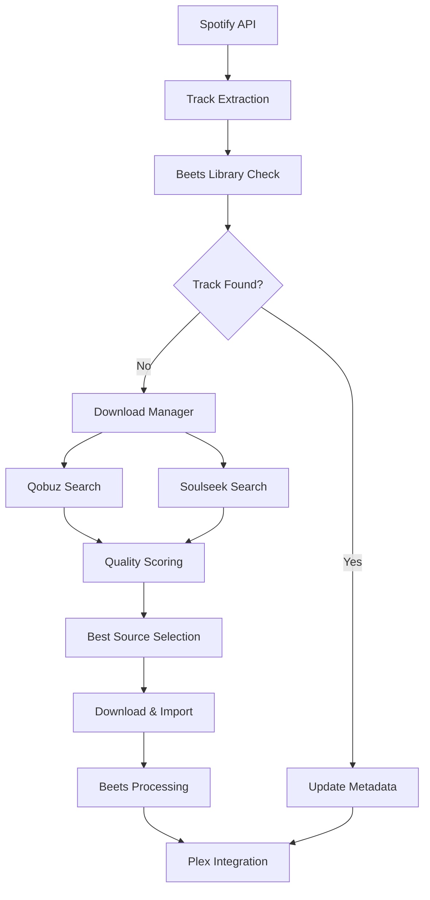

# 🌀 Periodeec

**Periodeec** is a comprehensive automated music synchronization system that bridges your Spotify playlists with your local Plex library. Enhanced with intelligent metadata management via [Beets](https://beets.io/) and multiple high-quality music downloaders, it creates a seamless ecosystem for music enthusiasts who demand both convenience and quality.

[](https://github.com/anatosun/periodeec/pkgs/container/periodeec)
[](https://python.org)
[](https://beets.io)

---

## ✨ Features

### 🎵 **Music Synchronization**
- **Spotify to Plex sync** with playlist and collection support
- **Local/unavailable track handling** - automatically detects and downloads missing tracks
- **Real-time progress tracking** with detailed logging and status updates
- **Smart caching system** for faster subsequent syncs

### 🤖 **Intelligent Metadata Management**
- **Beets integration** with comprehensive plugin support
- **Automatic audio analysis** and quality scoring
- **Multi-strategy matching** (ISRC, fuzzy text matching, metadata comparison)
- **Cross-platform filename sanitization** and organization

### 📥 **Multi-Source Downloads**
- **Qobuz** - Hi-Res/Lossless quality with advanced search strategies
- **Soulseek (slskd)** - P2P network with quality ranking and source scoring
- **Extensible downloader architecture** for easy integration of additional sources

### 🐳 **Modern Deployment**
- **Docker containers** with multi-architecture support (AMD64/ARM64)
- **Branch-based image tags** for development and testing workflows
- **GitHub Container Registry** integration with automated builds
- **Docker Compose** examples for easy deployment

### 🔧 **Developer-Friendly**
- **Comprehensive schema system** with status tracking and audio metadata
- **Conventional commit workflow** with automated CI/CD
- **Type hints** and modern Python practices
- **Extensible plugin architecture**

---

## 🚀 Quick Start

### Using Docker (Recommended)

```bash
# Pull the latest stable image
docker pull ghcr.io/anatosun/periodeec:latest

# Create your config directory
mkdir -p ./config ./music ./downloads

# Copy the example configuration
curl -o docker-compose.yml https://raw.githubusercontent.com/anatosun/periodeec/main/docker-compose.example.yml

# Edit your configuration
nano config/config.yaml

# Start the service
docker-compose up -d
```

### Development Setup

```bash
# Clone the repository
git clone https://github.com/anatosun/periodeec.git
cd periodeec

# Create virtual environment
python -m venv .venv
source .venv/bin/activate  # On Windows: .venv\Scripts\activate

# Install dependencies
pip install -r requirements.txt

# Run locally
python -m periodeec.main
```

---

## 📦 Available Docker Images

We provide automatically built images for multiple architectures:

| Tag | Description | Architecture |
|-----|-------------|-------------|
| `latest` | Latest stable from main branch | AMD64, ARM64 |
| `develop` | Latest development features | AMD64, ARM64 |
| `main` | Same as latest | AMD64, ARM64 |
| `feature-*` | Feature branch builds | AMD64, ARM64 |
| `release-*` | Release candidate builds | AMD64, ARM64 |

### Image Usage Examples

```bash
# Latest stable release
docker pull ghcr.io/anatosun/periodeec:latest

# Development version with latest features
docker pull ghcr.io/anatosun/periodeec:develop

# Specific feature branch
docker pull ghcr.io/anatosun/periodeec:feature-new-downloader

# ARM64 specific (if needed)
docker pull ghcr.io/anatosun/periodeec:latest-arm64
```

---

## ⚙️ Configuration

Create a comprehensive `config.yaml` file:

```yaml
# Core Settings
settings:
  # Beets Configuration
  beets:
    library: /app/music/library.blb
    directory: /app/music
    config_path: /config/beets.yaml

  # Directory Structure
  downloads: /app/downloads
  failed: /app/failed
  temp: /app/temp

  # Spotify API
  spotify:
    client_id: YOUR_SPOTIFY_CLIENT_ID
    client_secret: YOUR_SPOTIFY_CLIENT_SECRET
    cache_enabled: true
    rate_limit_rpm: 100

  # Plex Media Server
  plex:
    baseurl: http://plex-server
    port: 32400
    token: YOUR_PLEX_TOKEN
    section: Music
    create_collections: true
    create_playlists: true

# Downloader Configuration
downloaders:
  # Qobuz (High Quality)
  qobuz:
    enabled: true
    email: YOUR_QOBUZ_EMAIL
    password: YOUR_QOBUZ_PASSWORD
    quality: 27  # Hi-Res
    priority: 10

  # Soulseek via slskd
  slskd:
    enabled: true
    host: localhost
    port: 5030
    api_key: YOUR_SLSKD_API_KEY
    min_bitrate: 320
    priority: 30

# User Profiles
users:
  alice:
    spotify_username: alice_spotify_id
    sync_mode: both  # playlists, collections, or both
    plex_users:
      - alice@example.com
    preferences:
      download_missing: true
      preferred_quality: high
      sync_collaborative: true
      create_m3u: true
    schedule:
      frequency: 1440  # minutes (24 hours)
      retry_failed: true
```

---

## 🎯 Advanced Usage

### Running Modes

```bash
# One-time sync
docker run --rm -v ./config:/config -v ./music:/app/music \
  ghcr.io/anatosun/periodeec:latest python -m periodeec.main --once

# Continuous mode with scheduling
docker run -d -v ./config:/config -v ./music:/app/music \
  ghcr.io/anatosun/periodeec:latest python -m periodeec.main --run

# Validate configuration only
docker run --rm -v ./config:/config \
  ghcr.io/anatosun/periodeec:latest python -m periodeec.main --validate-config

# Status check
docker run --rm -v ./config:/config \
  ghcr.io/anatosun/periodeec:latest python -m periodeec.main --status
```

### Environment Variables

| Variable | Default | Description |
|----------|---------|-------------|
| `PERIODEEC_CONFIG` | `/config/config.yaml` | Configuration file path |
| `PERIODEEC_LOG_LEVEL` | `INFO` | Logging level |
| `PERIODEEC_CACHE_DIR` | `/app/cache` | Cache directory |
| `PUID` | `1000` | User ID for file permissions |
| `PGID` | `1000` | Group ID for file permissions |

---

## 🏗️ Architecture

### Core Components

```
periodeec/
├── main.py                 # Application entrypoint and orchestration
├── schema.py               # Unified data models (Track, User, metadata)
├── spotify_handler.py      # Spotify API with caching and rate limiting
├── plex_handler.py         # Plex Media Server integration
├── beets_handler.py        # Metadata management and library matching
├── download_manager.py     # Download orchestration and retry logic
└── modules/
    ├── downloader.py       # Base downloader interface
    ├── qobuz.py           # Qobuz high-quality downloads
    └── slskd.py           # Soulseek P2P integration
```

### Data Flow



---

## 🔧 Development

### Building Images

```bash
# Build locally
docker build -t periodeec:local .

# Build with specific target
docker build --target production -t periodeec:prod .

# Multi-architecture build
docker buildx build --platform linux/amd64,linux/arm64 -t periodeec:multi .
```

### Contributing

We follow conventional commit guidelines:

- `feat:` - New features
- `fix:` - Bug fixes
- `docs:` - Documentation updates
- `refactor:` - Code restructuring
- `ci:` - CI/CD improvements
- `chore:` - Maintenance tasks

```bash
# Example commits
git commit -m "feat: add Spotify local track detection"
git commit -m "fix: resolve beets 2.4.0 compatibility issue"
git commit -m "docs: update Docker deployment guide"
```

---

## 📊 Monitoring & Logging

### Health Checks

```bash
# Check application status
curl http://localhost:8080/health

# View recent logs
docker logs -f periodeec --tail=100

# Check download statistics
docker exec periodeec python -c "from periodeec.main import show_stats; show_stats()"
```

### Performance Tuning

| Setting | Default | Tuning Notes |
|---------|---------|--------------|
| `spotify.rate_limit_rpm` | 100 | Increase for faster sync |
| `spotify.cache_ttl_hours` | 24 | Reduce for more frequent updates |
| `downloaders.*.priority` | varies | Lower = higher priority |
| `beets.autotag.strong_rec_thresh` | 0.04 | Lower = stricter matching |

---

## 🆘 Troubleshooting

### Common Issues

**Docker Permission Issues**
```bash
# Fix file permissions
sudo chown -R 1000:1000 ./music ./downloads ./config

# Or use your user ID
docker run --user $(id -u):$(id -g) ...
```

**Spotify Authentication**
```bash
# Test API credentials
curl -X POST "https://accounts.spotify.com/api/token" \
  -H "Content-Type: application/x-www-form-urlencoded" \
  -d "grant_type=client_credentials&client_id=YOUR_ID&client_secret=YOUR_SECRET"
```

**Beets Library Issues**
```bash
# Reset beets library
docker exec periodeec beets stats
docker exec periodeec beets update
```

### Debug Mode

```yaml
# Add to config.yaml
settings:
  log_level: DEBUG
  debug_mode: true
  verbose_downloads: true
```

---

## 🎵 Supported Audio Formats

| Format | Quality | Qobuz | Soulseek | Notes |
|--------|---------|--------|----------|-------|
| FLAC | Lossless | ✅ | ✅ | Preferred for archival |
| ALAC | Lossless | ✅ | ✅ | Apple's lossless format |
| MP3 | Lossy | ✅ | ✅ | Universal compatibility |
| AAC/M4A | Lossy | ✅ | ✅ | High efficiency |
| OGG | Lossy | ❌ | ✅ | Open source alternative |

---

## 🌟 Credits & Acknowledgments

- **[Beets](https://beets.io/)** - The music library manager that does everything
- **[Spotipy](https://spotipy.readthedocs.io/)** - Lightweight Python library for Spotify Web API
- **[PlexAPI](https://python-plexapi.readthedocs.io/)** - Python bindings for Plex API
- **[slskd](https://github.com/slskd/slskd)** - Modern Soulseek daemon
- **[qobuz-dl](https://github.com/vitiko98/qobuz-dl)** - Qobuz music downloader

---

## 📄 License

MIT License - see [LICENSE](LICENSE) for details.

---

## 🤝 Contributing

Contributions are welcome! Please:

1. Fork the repository
2. Create a feature branch (`git checkout -b feature/amazing-feature`)
3. Follow conventional commit format
4. Add tests for new functionality
5. Update documentation as needed
6. Submit a Pull Request

For major changes, please open an issue first to discuss what you would like to change.

---

<div align="center">

**⭐ Star this repository if you find it useful!**

[📥 Download](https://github.com/anatosun/periodeec/releases) • [🐳 Docker Hub](https://github.com/anatosun/periodeec/pkgs/container/periodeec) • [📖 Wiki](https://github.com/anatosun/periodeec/wiki) • [🐛 Issues](https://github.com/anatosun/periodeec/issues)

</div>